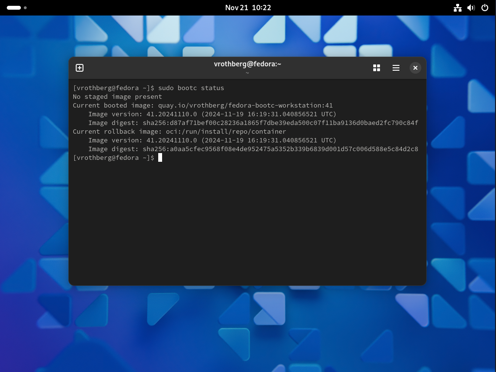

# [Fedora Bootc](https://docs.fedoraproject.org/en-US/bootc/) Workstation Images

This project aims at providing an easy way to build and manage Fedora bootc images for a GNOME-based workstations.
Once installed on your device, updates to your system happen in form of container images.
Follow the instructions below to create your own OS.

## Customizing the OS

The OS can be customized in the Containerfile which uses the `fedora-bootc` base image and adds only a few packages on top.
The idea is to containerize applications instead of making them part of the bootc host.
You may find [Toolbx](https://docs.fedoraproject.org/en-US/fedora-silverblue/toolbox/) to be a useful tool in that process.
This way, updates to applications are decoupled from the OS and do not require a reboot of the system.

## Build Steps

You can use the Makefile to automate most of the tasks involved:
* `make oci-image` to build the OCI image
* `make disk-image` to convert the OCI image into a disk image

Note that the build steps require root privileges, so please make sure to run make as root.

You can use the following variables to tweak the image via `make $VARIABLE=$VALUE`:
* `OCI_IMAGE` to change the reference of the OCI image (default: `quay.io/vrothberg/fedora-bootc-workstation:41`)
* `DISK_TYPE` to change the type of the disk image (default: `raw`)
* `ROOTFS` to change the default filesystem of the disk image (default: `xfs`)
* `ARCH` to change the architecture of the OCI and disk image (default: `amd64`)

Changing the variables may come in handy if you desire to run the disk image in a VM before.
For more information on supported values and next steps, please refer to the [bootc-image-builder](https://github.com/osbuild/bootc-image-builder) and the [Fedora Bootc documentation](https://docs.fedoraproject.org/en-US/bootc/).

## Installation Steps

1. Build the local disk images.
2. Copy the `./output/bootiso/install.iso` Anaconda ISO on to a USB stick.
3. Boot from the USB stick and follow the interactive installer.
